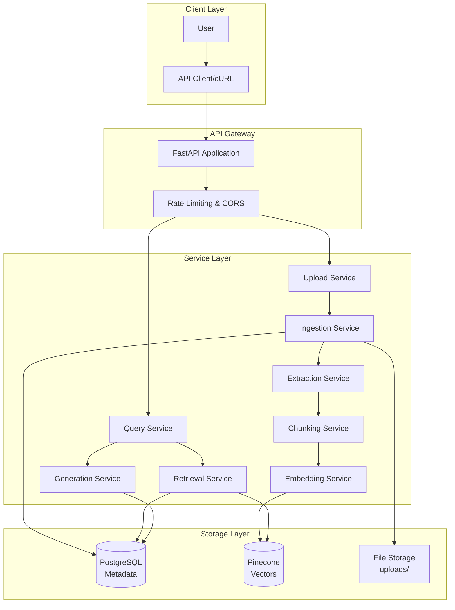
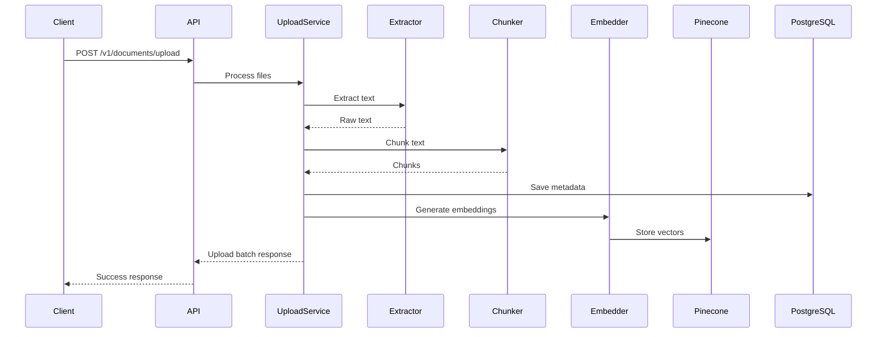
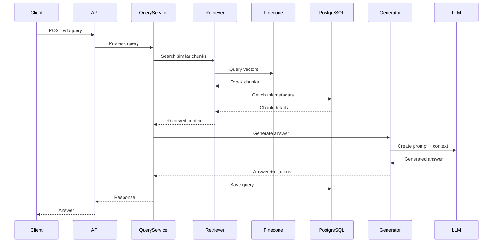
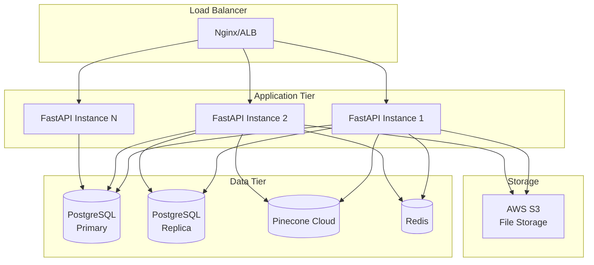

# Architecture Documentation

## System Overview

The RAG Pipeline is a production-ready system that enables document-based question answering. Users upload documents, which are processed, embedded, and stored in a vector database. When users query the system, it retrieves relevant document chunks and generates contextual answers using Large Language Models (LLMs).

### Key Capabilities

- **Document Ingestion**: Accepts PDF, DOCX, TXT files (up to 20 files, 1000 pages per document)
- **Text Extraction**: Intelligent extraction from various formats
- **Chunking**: Token-aware chunking with configurable overlap
- **Embedding Generation**: Automatic generation using OpenAI or Google AI
- **Vector Storage**: Pinecone for efficient semantic search
- **RAG Query**: Hybrid retrieval with LLM-based answer generation
- **Metadata Storage**: PostgreSQL for document and chunk tracking

---

## High-Level Architecture

---

## Component Architecture

### FastAPI Application

**File**: `app/main.py`

The FastAPI application serves as the API gateway:
- Routes incoming HTTP requests
- Applies middleware (CORS, rate limiting)
- Manages background tasks
- Provides OpenAPI documentation

**Key Features**:
- Health check endpoints
- Request logging
- Error handling
- Background task execution

---

### Upload Service

**File**: `app/services/ingestion_service.py`

Responsible for document upload and initial processing:

1. **File Validation**
   - File type checking (PDF, DOCX, TXT)
   - Size limits (50 MB per file)
   - Batch limits (20 files max)
   - Duplicate detection

2. **Text Extraction**
   - PDF extraction using PyMuPDF
   - DOCX extraction using python-docx
   - TXT direct reading
   - Error handling for corrupt files

3. **Chunking**
   - Token-aware splitting
   - Configurable overlap (default 150 tokens)
   - Preserves context across chunks

4. **Storage**
   - Saves files to `uploads/` directory
   - Stores metadata in PostgreSQL
   - Tracks upload progress

---

### Embedding Service

**File**: `app/services/embeddings/`

Generates vector embeddings for document chunks:

**Providers**:
- OpenAI: `text-embedding-3-large` (768 dimensions)
- Google AI: `models/text-embedding-004` (768 dimensions)

**Process**:
1. Batch processing (64 chunks at a time)
2. API calls to provider
3. Embedding generation
4. Upsert to Pinecone
5. Store embedding IDs in PostgreSQL

---

### Vector Storage (Pinecone)

**Purpose**: Store chunk embeddings for semantic search

**Configuration**:
- Index name: `ragingestion-google` (configurable)
- Dimension: 768
- Metric: cosine
- Namespace: Optional for multi-tenant

**Operations**:
- Upsert: Add/update embeddings
- Query: Search similar embeddings
- Delete: Remove document chunks

---

### RAG Service

**Files**: `app/services/rag/`

Implements the complete RAG pipeline:

**Components**:

1. **Query Service** (`query_service.py`)
   - Accepts user queries
   - Manages query history
   - Coordinates retrieval and generation

2. **Retrieval Service** (`retrieval_service.py`)
   - Hybrid search (semantic + keyword)
   - MMR (Maximal Marginal Relevance) for diversity
   - Top-K retrieval (default 10 chunks)

3. **Generation Service** (`generation_service.py`)
   - Context preparation
   - LLM prompting
   - Answer generation
   - Citation extraction

---

### Database Models

**PostgreSQL** stores all metadata:

**Tables**:
- `documents`: Document metadata (filename, status, page count)
- `chunks`: Chunk metadata (content, position, embedding_id)
- `uploads`: Upload batch tracking
- `queries`: Query history

---

## Data Flow

### Upload Flow

### Query Flow

---

## Technology Stack

### Backend
- **FastAPI**: Python web framework
- **SQLAlchemy**: ORM for database
- **Alembic**: Database migrations
- **Pydantic**: Data validation

### AI/ML
- **OpenAI API**: GPT-4o-mini, text-embedding-3-large
- **Google AI**: Gemini 2.5 Pro, text-embedding-004

### Databases
- **PostgreSQL**: Metadata storage
- **Pinecone**: Vector database
- **Redis**: Caching and rate limiting

### Infrastructure
- **Docker**: Containerization
- **Docker Compose**: Multi-container orchestration
- **Gunicorn**: WSGI server

### Development
- **pytest**: Testing framework
- **Black**: Code formatting
- **Ruff**: Linting

---

## System Limits

### Upload Limits
- **Max documents per upload**: 20 files
- **Max pages per document**: 1,000 pages
- **Max file size**: 50 MB per file
- **Supported formats**: PDF, DOCX, TXT, MD

### Processing
- **Chunk size**: 1,000 tokens (default)
- **Chunk overlap**: 150 tokens (default)
- **Embedding dimension**: 768
- **Retrieval top-K**: 10 chunks (default)

### Rate Limiting
- **Upload**: 10 requests per hour
- **Query**: 20 requests per minute
- **Read**: 100 requests per minute
- **Delete**: 20 requests per minute

---

## Security

### Authentication
- API key-based authentication (configurable)
- Rate limiting per IP/API key

### Data Security
- File validation before processing
- SQL injection prevention (SQLAlchemy ORM)
- CORS protection
- HTTPS support (production)

---

## Scalability

### Horizontal Scaling
- Stateless API servers
- Multiple Gunicorn workers
- Load balancer support
- Shared PostgreSQL database

### Vertical Scaling
- Increase chunk size for larger documents
- Parallel embedding generation
- Caching layer (Redis)

---

## Monitoring & Observability

### Health Checks
- Application health: `/health`
- Database connectivity
- Pinecone connectivity
- LLM provider status

### Logging
- Application logs via Python logging
- Request/response logging
- Error tracking
- Background task logging

### Metrics
- Request count
- Processing times
- Error rates
- Storage usage

---

## Deployment Architecture

---

## Error Handling

### Graceful Degradation
- File extraction failures logged, processing continues
- Embedding generation retries on failure
- Query fallback to basic retrieval if LLM fails

### Error Types
- `FileValidationError`: Invalid file type/size
- `ExtractionError`: Corrupt or unsupported files
- `ChunkingError`: Text processing failures
- `EmbeddingError`: API failures
- `RetrievalError`: Vector search failures
- `GenerationError`: LLM failures

---

## Performance Optimization

### Caching
- Redis for rate limiting
- Query result caching
- Embedding result caching

### Batching
- Embedding generation in batches (64 chunks)
- Pinecone upsert in batches (100 vectors)
- Parallel processing where possible

### Database Optimization
- Indexed fields for fast lookups
- Connection pooling
- Query optimization

---

For more information, see:
- [API Examples](api-examples.md)
- [Operations Guide](operations.md)
- [Configuration Guide](configuration.md)

